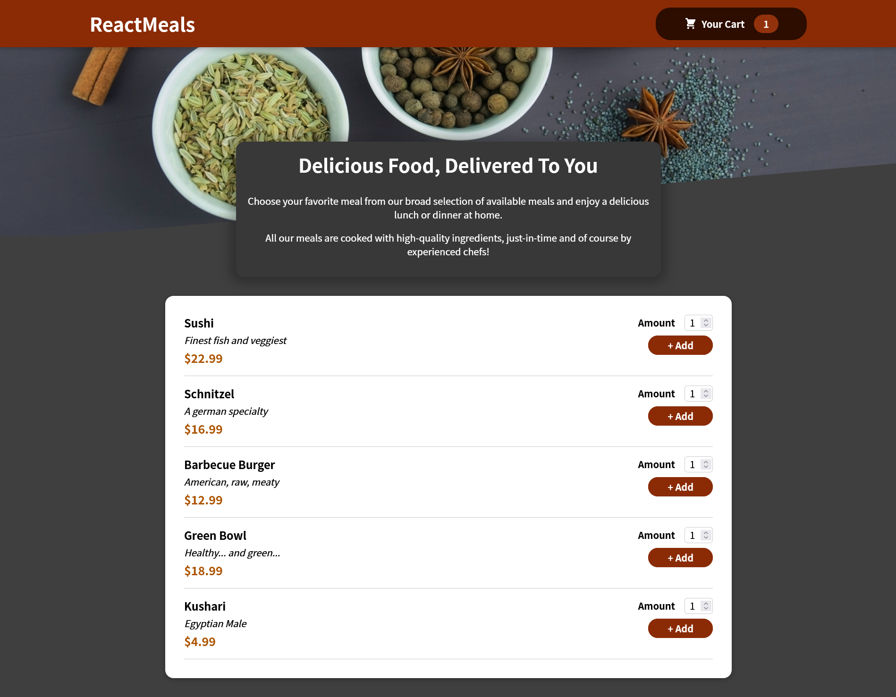
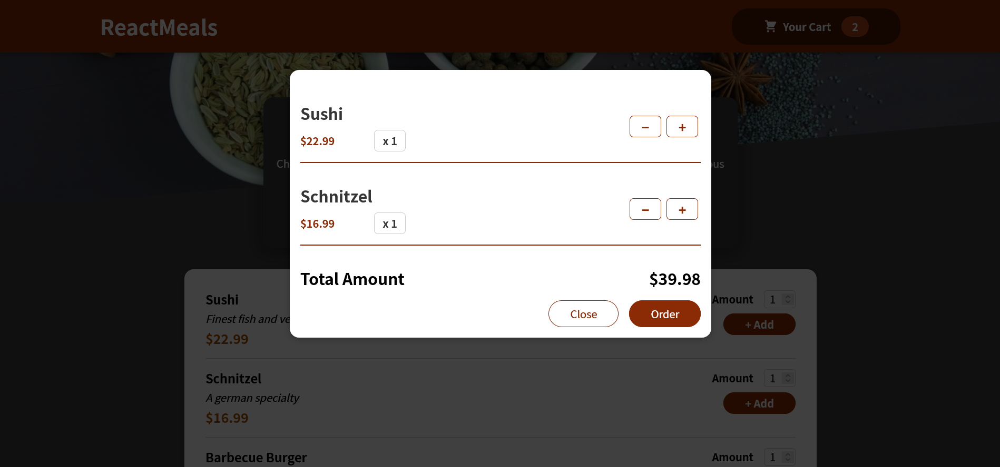
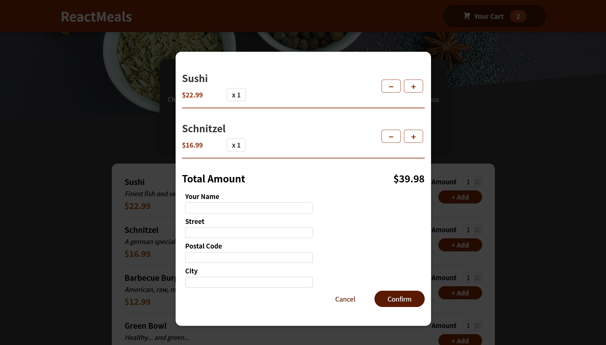
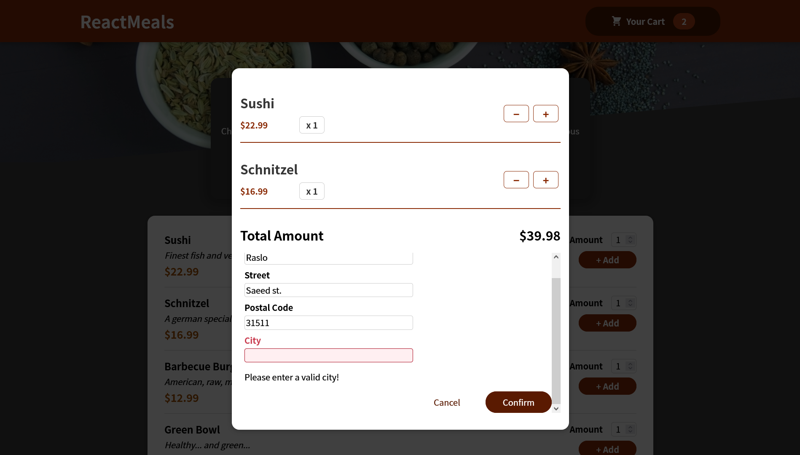
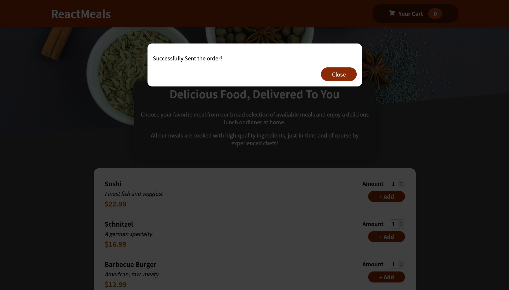

## About The Project







Food Order App is a React application that is created while following a React Udemy Course by Maximilian Schwarzmüller 

### Built With

This app is built with React.js, Hooks alongside with HTML and CSS Modules. It uses NPM as package manager, and Firebase as a backend HttpRequest.

- [React](https://reactjs.org/)
- [Hooks](https://usehooks.com/)
- [JavaScript](https://developer.mozilla.org/en-US/docs/Web/javascript)
- [Firebase](https://firebase.google.com/)
- [HTML](https://developer.mozilla.org/en-US/docs/Web/HTML)
- [CSS](https://developer.mozilla.org/en-US/docs/Web/css)
- [NPM](https://www.npmjs.com/)

### Installation

1. Clone the repo
   ```sh
   git clone https://github.com/AbdallahRaslan/FoodOrderApp.git
   ```
2. Install NPM packages
   ```sh
   npm install
   ```

3. Run Start 
   ```sh
   npm start
   ```
